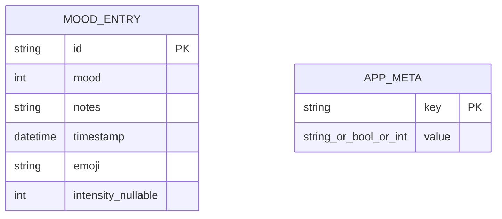
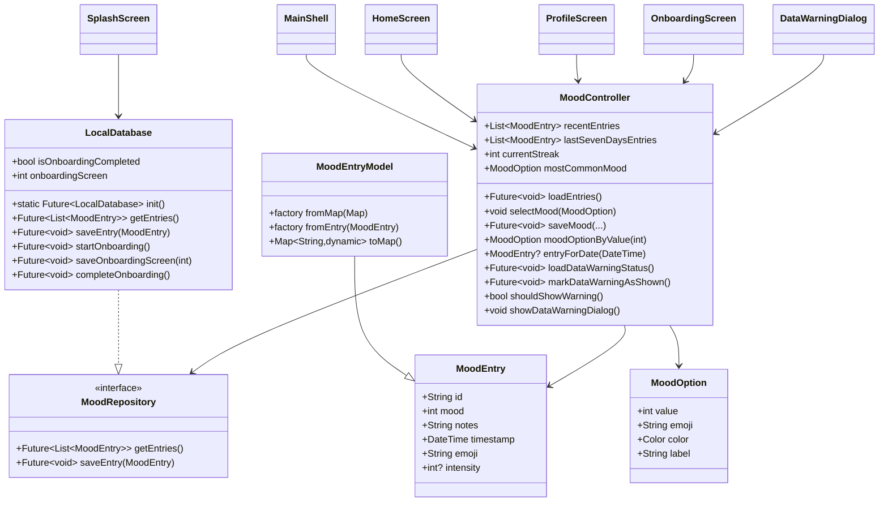
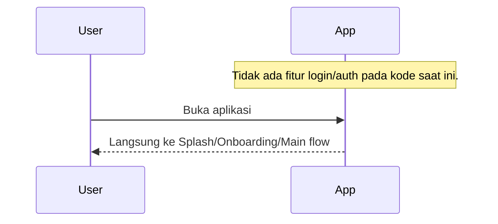
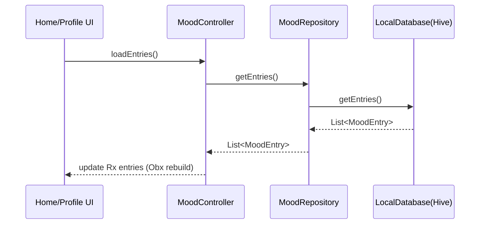
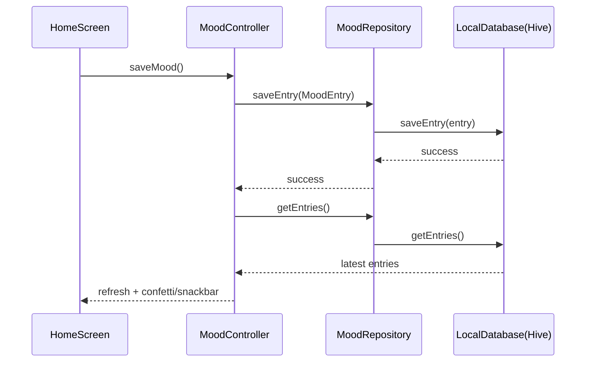
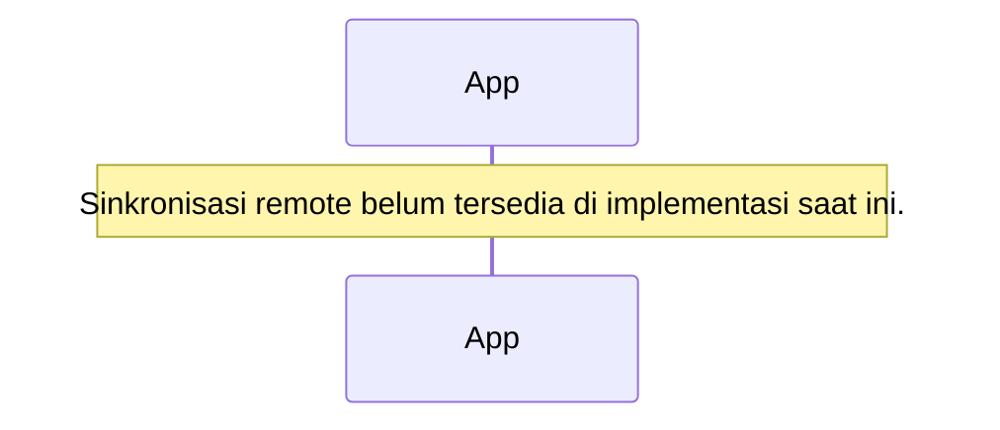

# Mood Tracker

Mood Tracker adalah aplikasi Flutter untuk mencatat suasana hati harian, melihat riwayat, dan memantau tren sederhana 7 hari terakhir secara lokal di perangkat.

## Project Overview

- Platform: Flutter (Material 3)
- State management: GetX (`get`)
- Local database: Hive (`hive`, `hive_flutter`)
- Local preferences: SharedPreferences (`shared_preferences`)
- Visualisasi: `fl_chart`, `flutter_animate`, `lottie`, `confetti`

## Architecture Overview

Project ini mengikuti pola layered sederhana (mirip clean layering ringan):

- `presentation/`: UI, screen, widget, dan state orchestration lewat `MoodController`
- `domain/`: entitas inti (`MoodEntry`) dan kontrak repository (`MoodRepository`)
- `data/`: implementasi repository berbasis Hive (`LocalDatabase`) dan mapper model (`MoodEntryModel`)
- `shared/`: komponen UI reusable lintas fitur (dialog)
- `constant/`: konstanta global

Data flow utama:

1. UI memanggil `MoodController`.
2. `MoodController` membaca/menulis melalui `MoodRepository`.
3. Implementasi aktif `LocalDatabase` menyimpan data ke Hive box lokal.
4. Data kembali ke controller (Rx state) lalu dirender ulang oleh widget `Obx`.

## Folder Structure

```text
lib/
  constant/
    constant.dart
  data/
    models/
      mood_entry_model.dart
    sources/
      local_database.dart
  domain/
    models/
      mood_entry.dart
    repositories/
      mood_repository.dart
  presentation/
    controllers/
      mood_controller.dart
    screens/
      splash_screen.dart
      onboarding_screen.dart
      main_shell.dart
      home_screen.dart
      profile_screen.dart
    widgets/
      mood_selector.dart
      mood_chart.dart
      streak_counter.dart
      wave_background.dart
  shared/
    dialog/
      data_warning_dialog.dart
```

## Application Flow Diagram

```mermaid
flowchart TD
    A[App Launch] --> B[main()]
    B --> C[LocalDatabase.init]
    C --> D[Register LocalDatabase + MoodController in GetX]
    D --> E[SplashScreen]
    E --> F{Onboarding completed?}
    F -- No --> G[OnboardingScreen]
    G --> H[Optional first mood save]
    H --> I[Mark onboarding complete]
    I --> J[MainShell]
    F -- Yes --> J[MainShell]

    J --> K[HomeScreen: Save Mood]
    K --> L[MoodController.saveMood]
    L --> M[LocalDatabase.saveEntry]
    M --> N[Hive box mood_entries]
    L --> O[Reload entries]
    O --> J

    J --> P[ProfileScreen]
    P --> Q[Read stats from controller entries]

    J --> R{Data warning shown?}
    R -- No --> S[DataWarningDialog]
    S --> T[markDataWarningAsShown via SharedPreferences]
    T --> J
```

## Local Database Documentation

### Technology

- Hive key-value storage via `Hive.openBox('mood_entries')`
- Satu box menyimpan:
  - Mood entries (`id` -> map payload)
  - Metadata onboarding (`onboarding_completed`, `onboarding_started_at`, `onboarding_screen`)

### Initialization

1. `main()` memanggil `LocalDatabase.init()`
2. `Hive.initFlutter()` dijalankan
3. Box `mood_entries` dibuka
4. Instance `LocalDatabase` dimasukkan ke GetX DI

### Migration Strategy

- Saat ini belum ada versi schema/migration formal.
- Struktur data disimpan sebagai map sederhana.
- Perubahan schema ke depan perlu fallback parsing di `MoodEntryModel.fromMap` untuk backward compatibility.

### CRUD Flow

- Create/Update:
  - `MoodController.saveMood()` -> `MoodRepository.saveEntry()` -> `LocalDatabase.saveEntry()` -> `box.put(id, map)`
- Read:
  - `MoodController.loadEntries()` -> `MoodRepository.getEntries()` -> `LocalDatabase.getEntries()`
- Delete:
  - Belum diimplementasikan pada kode saat ini.

### Repository Interaction

- `MoodController` hanya bergantung pada kontrak `MoodRepository`.
- `LocalDatabase` adalah implementasi konkret yang aktif.

### Offline-first Behavior

- Aplikasi berjalan full lokal tanpa API/network sync.
- Semua mood entries tersedia offline selama data aplikasi tidak dihapus.

## Database UML (ERD)

Catatan: karena Hive key-value, ERD berikut memodelkan entitas logis (bukan tabel SQL fisik).



### Relationship Explanation

- `MOOD_ENTRY` menyimpan jurnal mood harian.
- `APP_META` menyimpan konfigurasi/progress aplikasi (onboarding).
- Tidak ada foreign key atau relasi 1:N/N:N di implementasi saat ini.
- Ownership data:
  - `MOOD_ENTRY` dimiliki fitur mood journaling.
  - `APP_META` dimiliki flow onboarding/app preference.

## Class Diagram



## Sequence Diagrams

### 1) Login / Authentication



### 2) Fetch Data dari Local Database



### 3) Insert/Update Mood Entry



### 4) Synchronization Process



## State Management

- Menggunakan GetX:
  - Dependency injection: `Get.put(...)` di `main()`
  - Reactive state: `Rx`, `Rxn`, `Obx`
  - Navigation/dialog: `Get.off`, `Get.dialog`, `Get.back`, `Get.snackbar`

## Usage Examples

### Controller (State Management)

```dart
final controller = Get.find<MoodController>();
controller.selectMood(controller.moods.first);
controller.notesController.text = 'Need some rest';
await controller.saveMood();
```

### Repository + Local Database

```dart
final db = await LocalDatabase.init();
final entries = await db.getEntries();
await db.saveEntry(
  MoodEntry(
    id: DateTime.now().microsecondsSinceEpoch.toString(),
    mood: 5,
    notes: 'Great day',
    timestamp: DateTime.now(),
    emoji: '😊',
  ),
);
```

### Complex Widget

```dart
Scaffold(
  body: Column(
    children: const [
      MoodSelector(),
      SizedBox(height: 220, child: MoodChart()),
    ],
  ),
);
```

## Dependencies

Lihat `pubspec.yaml`. Dependensi runtime utama:

- `get`
- `hive`
- `hive_flutter`
- `shared_preferences`
- `fl_chart`
- `confetti`
- `flutter_animate`
- `intl`
- `lottie`

## Getting Started

1. Install Flutter SDK compatible dengan `sdk: ^3.10.4`.
2. Jalankan:

```bash
flutter pub get
flutter run
```

## Build & Run

- Debug run:

```bash
flutter run
```

- Release build Android:

```bash
flutter build apk --release
```

- Release build iOS:

```bash
flutter build ios --release
```

## Screenshots

- Splash screen: `[placeholder]`
- Onboarding screen: `[placeholder]`
- Home screen: `[placeholder]`
- Profile/statistics screen: `[placeholder]`

## API / Developer Notes

- Tidak ada public API/network contract di project saat ini.
- Perubahan pada commit dokumentasi ini bersifat dokumentatif (DartDoc + README), tanpa perubahan kontrak runtime.

## Assumptions

- Dokumentasi ini diturunkan dari source code saat ini.
- Karena tidak ditemukan lapisan API/sync/auth, bagian tersebut ditandai sebagai tidak tersedia.
- ERD dimodelkan sebagai entitas logis Hive (non-relational), bukan tabel SQL fisik.
